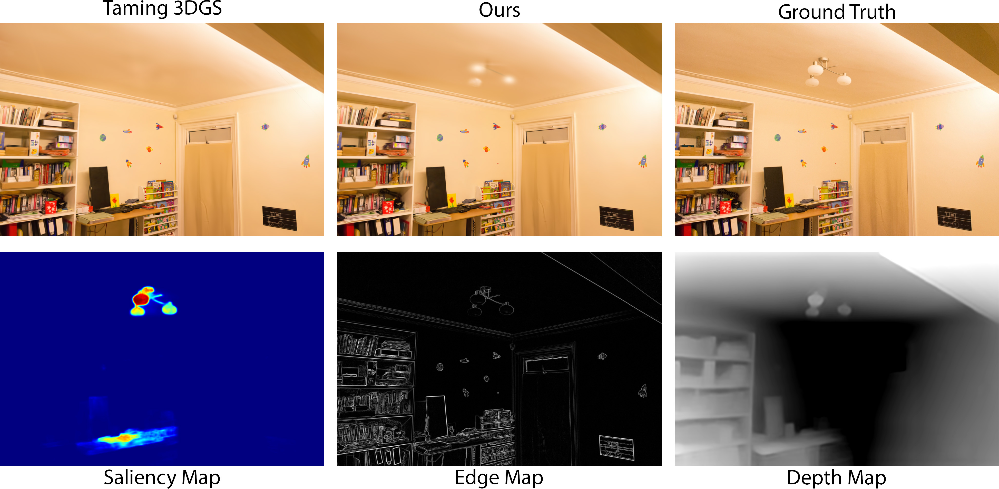
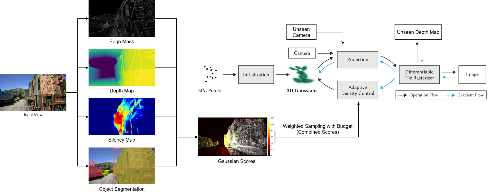

<div align="center">

# Perception-Aware Training for 3D Gaussian Splatting under Limited Resources

[Jiepeng (Frank) Chen](https://frankjc2022.github.io/)

<p>University of Toronto<p>

### [Paper](https://frankjc2022.github.io/perception-aware-3dgs/assets/perception_aware_3dgs.pdf) | [Project Page](https://frankjc2022.github.io/perception-aware-3dgs/)

 
 

</div>


## Dependencies

This project builds upon the Taming 3DGS implementation. Please follow the installation instructions in the official repository: [Taming 3DGS GitHub Repo](https://github.com/humansensinglab/taming-3dgs).

## Preparing Dataset

Our project utilizes the **MipNeRF360**, **Tanks&Temples**, and **Deep Blending** datasets. To download and prepare these datasets, please refer to the instructions provided in the official 3D Gaussian Splatting repository: [3DGS Github Repo](https://github.com/graphdeco-inria/gaussian-splatting)

The preprocessing script is located at `./preprocessing/preprocessing.py`. It has been adapted from the official Gaussian Splatting implementation. Please modify the paths in the script to match your setup before running it.

This script generates four additional folders, each corresponding to one of the following perceptual masks:

- **Saliency Map** (via [U2Net](https://github.com/xuebinqin/U-2-Net) [[Qin et al., 2020]](https://arxiv.org/abs/2005.09007))
- **Object Segmentation Mask** (via [YOLOv11](https://github.com/ultralytics/ultralytics))
- **Edge Map** (via the classical **Sobel filter**)
- **Monocular Depth Map** (via [ZoeDepth](https://github.com/isl-org/ZoeDepth) [[Bhat et al., 2023]](https://arxiv.org/abs/2302.12288))

To ensure proper saliency map generation, please update the path at the top of `preprocessing/saliency_map.py` to point to your `U-2-Net` folder.

## Training
The training process is consistent with the Taming 3DGS implementation. All arguments available in the Taming 3DGS implementation are compatible here, with additional arguments introduced for our modifications. Below is an example command we use for training:

```
python train.py -s <path to COLMAP dataset> --eval -m <path to output folder> --densification_interval 500 --mode "multiplier" --budget 2 --optimizer_type sparse_adam --test_iterations 30000 --sh_lower --segment_mask --depth_map --edge_mask --saliency_map --combine_scores --unseen_loss

```
<details>
<summary><span style="font-weight: bold;">Extra Command Line Arguments for train.py</span></summary>

  #### --segment_mask  
  Flag to use the object segmentation mask. The folder `segment_masks/` containing the mask images must be located under the dataset directory.
  #### --depth_map  
  Flag to use the depth map. The folder `depth_maps/` containing depth maps must be located under the dataset directory.
  #### --edge_mask  
  Flag to use the edge map. The folder `edge_masks/` containing edge maps must be located under the dataset directory.
  #### --saliency_map  
  Flag to use the saliency map. The folder `saliency_maps/` containing saliency maps must be located under the dataset directory.
  #### --combine_scores
  Flag to combine Taming 3DGS with our perceptual score. Without this flag, only perceptual scores are used for densification.
  #### --unseen_loss
  Flag to use the unseen-view depth loss during training.

</details>

## Evaluation

The evaluation process follows the same steps as the official Gaussian Splatting implementation. Use the commands below:
```
python render.py -m <path to pre-trained model> -s <path to COLMAP dataset>
python metrics.py -m <path to pre-trained model>
```


## SIBR Viewer Compatibility

Taming 3DGS modifies the opacity activation function during training, which may cause incompatibility with the SIBR viewer.  
To maintain compatibility, disable the opacity modification logic in `train.py` by removing or commenting out the following lines:

```python
if iteration == args.ho_iteration:
    print("Release opacity limit")
    gaussians.modify_functions()
```

Also, update the `rendering_mode` in `render.py` to ensure consistent opacity rendering:
```python
gaussians = GaussianModel(dataset.sh_degree, optimizer_type="default", rendering_mode="abs")
```

## GPU Requirement
We trained our models using an **NVIDIA RTX 4080 GPU**.  
For optimal performance, ensure you have access to a similar or higher-tier GPU with sufficient VRAM.
